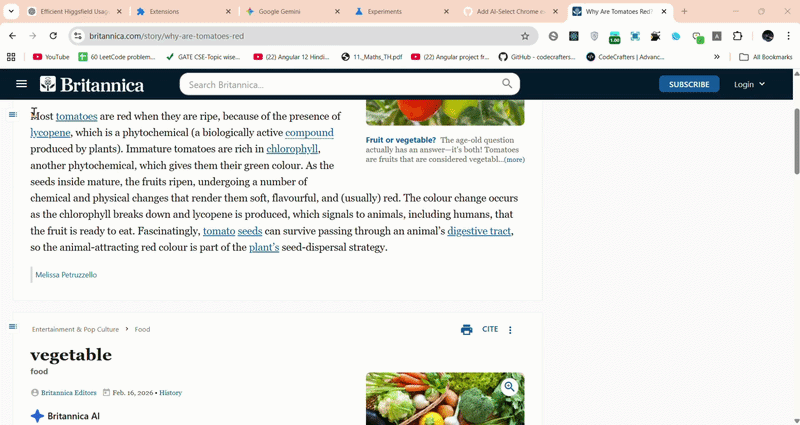

# AI-Select Chrome Extension

**AI-Select** is a zero-backend Chrome extension that adds a small floating action button next to text selected on any webpage. Pressing it triggers Chrome's built-in on-device AI (`Summarizer API` via Gemini Nano) to instantly generate concise, actionable summaries.

## ✨ Features

- **Contextual UI**: Hover and click the lightweight `✨` floating button right alongside your active text selection.
- **Privacy-First**: Operates 100% locally on your machine. No server-side analytics, no remote API calls, no cloud latency. 
- **Highly Configurable**: Use the extension popup to customize output preferences (`TLDR`, `Teaser`, `Key Points`, `Headline`), Lengths (`Short`, `Medium`, `Long`), and Formats (`Markdown`, `Plain text`).
- **Real-time Streaming**: Toggle the streaming capability to see the text generated chunk-by-chunk natively.
- **Smart Dismissal**: Hides the UI cleanly when not in use or when clicking away, equipped with dedicated exit icons.

## 🚀 Setup & Installation

1. Open Chrome and navigate to `chrome://extensions`.
2. Enable **Developer mode** in the top right corner.
3. Click **Load unpacked**.
4. Select the `AI-Select` folder.
5. Pin the extension on your toolbar to configure settings.

## 🛠️ Requirements & Notes

Running on-device AI requires substantial underlying hardware support:
- Google Chrome version **138+**.
- Hardcap requirements on Device Memory (>16GB CPU or >4GB GPU).
- At least 22GB of storage.
- An unmetered connection for the one-time local model download fallback.
> The extension executes a fallback download listener if the AI nano model hasn't been instantiated yet natively in Chrome.

### ⚠️ Troubleshooting (The device is not eligible)

If you get an error stating **"The device is not eligible for running on-device model."**, you need to manually enable the API flags.

Do this:
1. Go to `chrome://flags/#optimization-guide-on-device-model`
2. Set it to **Enabled BypassPerfRequirement**. *(Note: Plain "Enabled" often fails to expose the API if the benchmark hasn't run).*
3. Go to `chrome://flags/#prompt-api-for-gemini-nano`
4. Set it to **Enabled**.
5. Relaunch Chrome completely.

---

### 🌐 Explore Other Chrome AI APIs

Chrome has other built-in AI APIs which you can check out on the [getting started guide](https://developer.chrome.com/docs/ai/get-started):

- Translator API
- Language Detector API
- Summarizer API
- Writer API and Rewriter API
- Proofreader API
- Prompt API

---

### 📚 Documentation

For deeper architectural outlines, mechanical overviews of the `Summarizer` implementation, and contribution context, please refer to the [Developer Guide](DEVELOPER_GUIDE.md).
